This lab will give you hands-on experience with Cloudera Data Science
Workbench (CDSW).

In particular it will ensure that you experience:

-   Self-service

-   Security

-   Creation of Projects

-   Integration with Git

-   Ability to install and use custom packages

-   Basic Python Visualizations

-   Connectivity to Hadoop filesystem via PySpark

-   R connectivity to Hadoop cluster via Sparklyr

-   Demonstration of remote connectivity to a running program

-   Using Experiments to batch execute workloads where the code, input
    > parameters, and output artifacts are versioned.

[[Accessing CDSW]{.underline}](#accessing-cdsw)

[[Lab 1 - Self-Registration]{.underline}](#lab-1---self-registration)

[[Lab 2 - Hadoop
Authentication]{.underline}](#lab-2---hadoop-authentication)

[[Lab 3 - Creating your first
project]{.underline}](#lab-3---creating-your-first-project)

[[Lab 4 - Visualization and
Sharing]{.underline}](#lab-4---visualization-and-sharing)

[[Lab 5 - Hadoop Integration - Run a PySpark
job]{.underline}](#lab-5---hadoop-integration---run-a-pyspark-job)

[[Lab 6 - Pushing the Boundaries with
TensorFlow]{.underline}](#lab-6---pushing-the-boundaries-with-tensorflow)

[[Lab 7 - R]{.underline}](#lab-7---r)

> [[SparklyR]{.underline}](#sparklyr)
>
> [[Shiny]{.underline}](#shiny)

[[Lab 8 - Scala]{.underline}](#lab-8---scala)

[[Lab 9 - Experiments]{.underline}](#lab-9---experiments)

[[Lab 10 - Models]{.underline}](#lab-10---models)

[[Lab 11 - Scheduling Jobs]{.underline}](#lab-11---scheduling-jobs)

[[Appendix]{.underline}](#appendix)

> [[Using your own CDSW
> cluster]{.underline}](#using-your-own-cdsw-cluster)

[[Troubleshooting]{.underline}](#troubleshooting)

> [[DNS Issue]{.underline}](#dns-issue)
>
> [[Spark R backend might have
> failed]{.underline}](#spark-r-backend-might-have-failed)
>
> [[ImportError: No module named
> google.protobuf]{.underline}](#importerror-no-module-named-google.protobuf)

Accessing CDSW
==============

You will need to use a browser to connect to the CDSW system. The CDSW
URL for this workshop is:
**[[http://cdsw.cloudera-partner.com/]{.underline}](http://cdsw.cloudera-partner.com/)
**

Lab 1 - Self-Registration
=========================

For this system we've turned on self-registration, but you can restrict
registration to invitation only if you'd prefer. And users can be
integrated with LDAP, providing a single username/password consistent
with other parts of the organization.

1.  Go to CDSW at the URL as described above in "Accessing CDSW"

2.  Register yourself by clicking the link "Sign-Up for a New Account".
    > Use **userXX**, where **XX** is the number assigned to you by your
    > instructor .\
    > Use a simple password you can remember - 'cloudera' will do!

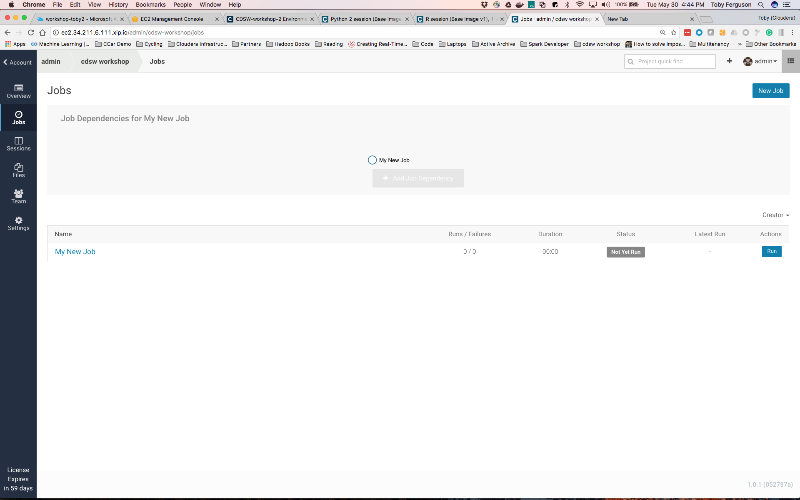{width="5.729166666666667in"
height="4.052083333333333in"}

{width="5.46875in"
height="5.677083333333333in"}

**Question**: How will this help your IT group manage the explosive
growth of Data Scientists?

**Question**: How do you sign out of your account? - Do it now, then
sign back in.

**Question**: Does your laptop have enough RAM to run different types
and loads for Data Science jobs you would like to utilize? Look at the
main Dashboard. How much RAM and vCPUs are setup in our lab environment
for the group to use?

 
-

Lab 2 - Hadoop Authentication
=============================

Only do this lab if you know your cluster is kerberized AND you know
your kerberos credentials.

At Cloudera we believe all clusters should be secured with Kerberos.
However configuring a regular Jupyter notebook to gain access to a
secure cluster is very difficult. Here we show you how easy it is with
CDSW:

1.  Navigate to **Settings → Hadoop Authentication**

{width="6.510416666666667in"
height="5.927083333333333in"}

2.  The Principal and password you'll use vary depending on how you're
    > taking this lab:

    a.  If using the Cloudera provided online training then use
        > Principal **userXX\@HADOOP.LOCAL** and **Cloudera1** as your
        > password, where **XX** is the number assigned to you by the
        > instructor.

    b.  If using your own lab then your administrator will need to
        > provide this to you.

3.  Hit **Authenticate**:

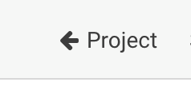{width="5.989583333333333in"
height="4.083333333333333in"}

And that's it! - you're now ready to work on a secured cluster.

In a normal production setting each of you would have separate
authentication credentials as we are doing. It's also possible to have
users access Hadoop with the same credentials but that's not a best
practice and often violates company and compliance policies.

**Question**: Will IT finally allow your Data Scientists access to the
secured data in Hadoop?

**Question**: How do you think you might use the public SSH key that's
made available in this Settings section?

**Question**: If an alternate solution hardcoded Hadoop credentials in
the application code, how big of a problem do you think that would be to
maintain and stay compliant within your company and our at your
customer?

 
-

Lab 3 - Creating your first project
===================================

In this lab we're going to create a project by forking from the
**cdsw-demo** project setup by the leader user **user00** (and into
which that user has already installed all the R libraries - this is a
typical workflow for CDSW: a central project that has many of the
dependencies installed, and which people fork to work on their own
code). We'll install some python packages too for our python code:

1.  Go to the **user00**'s project page by replacing your user name in
    > the URL with user00:
    > [[http://cdsw.cloudera-partner.com/user00]{.underline}](http://cdsw.cloudera-partner.com/leader)

2.  Select the project provided (**cdsw-demo** in below screenshot:

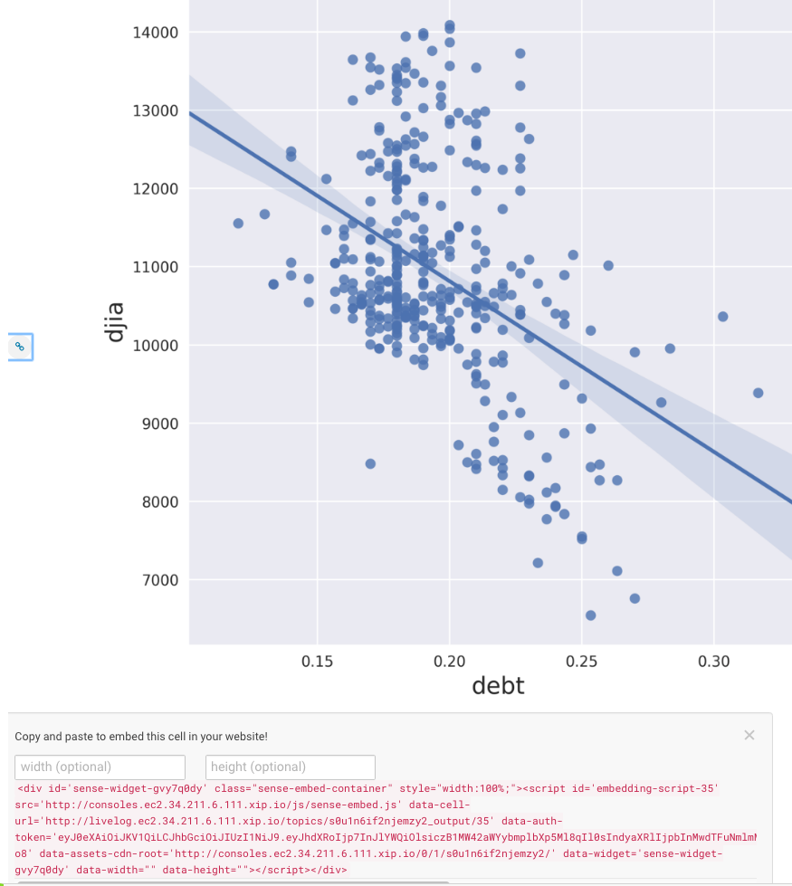{width="7.5in"
height="2.236111111111111in"}

3.  Hit the **Fork** button at the top right and you'll be given a
    > choice of where to fork this project (there'd be more choices if
    > you were a member of one or more teams). Select **\@userXX**

4.  When its finished you'll see that you're being shown the forked
    > version

{width="7.5in" height="2.25in"}

5.  So we've created a project by forking from another project. Now
    > we're going to add the python packages, just to show that anyone
    > can add whatever packages they need to their own project:

6.  Select **Open Workbench** (blue button, top right) and you'll be
    > taken to the workbench. This is the main area that you'll use when
    > working in a project with CDSW.

7.  On the far left is a file browser (note the little 'refresh' icon at
    > the top: {width="0.375in"
    > height="0.3541666666666667in"})

8.  In the middle is an editor open on the file that you selected - in
    > this case the README.md file.

9.  On the right is a Session Start tile - in this case it's waiting for
    > you to select an engine to run (so far your project has file space
    > but no compute sessions).

10. Select the **Python 2 kernel**; select the 2 vCPU / 4 GB Engine (and
    > use this size engine for all your Python sessions in this
    > workshop) and then the **Launch Session** button. This will
    > startup a Python engine and the right hand side will become two
    > tiles. The top one is an output tile and the bottom one (with a
    > red, then green left hand border) is a shell input window.

{width="7.5in"
height="3.4166666666666665in"}

{width="6.5in"
height="3.6527777777777777in"}

11. Rename your session from 'Untitled Session' to something more
    > interesting (I usually start with a language indicator and then
    > other stuff - 'P2: package install', for example). Do this by
    > clicking on the edit icon
    > 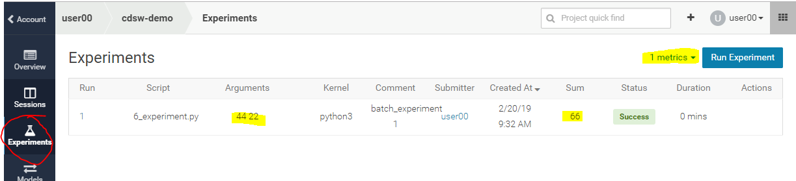{width="0.23958333333333334in"
    > height="0.21875in"}just to the right of the 'Untitled Session'
    > title. We won't remind you but we do expect you to do this
    > whenever you open up a new session from now on. Your session
    > heading should now look something like this:

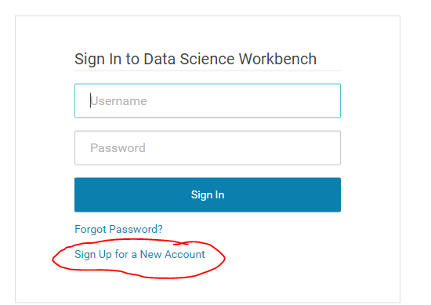{width="4.677083333333333in"
height="0.7395833333333334in"}

12. Now to show you some cool stuff ...

13. Look at this line in the README.md:

14. !pip2 install \--upgrade pip dask keras matplotlib
    > pandas\_highcharts protobuf tensorflow seaborn sklearn

15. Question: What does this do? If you know Python it should be
    > obvious; if you don't, then let me tell you: this is an execution
    > of pip (a Python package manager), which will tell the system
    > upgrade the listed packages

16. Put your cursor at that line and select '**Run Line(s)**'

17. The cursor on the left should turn to red and, after a few seconds,
    > you should see output like this:

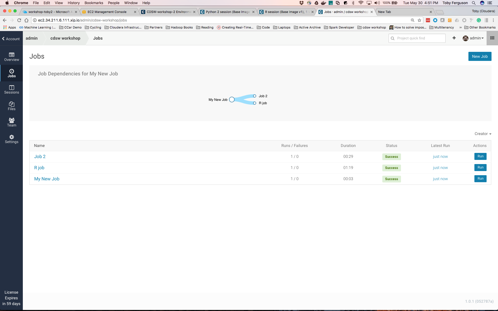{width="7.5in"
height="3.361111111111111in"}

18. What's happening here is that the code in the file is being executed
    > in the console (did you notice the left hand edge turned red?) and
    > now you can see the output in the right hand screen.

19. **Question**: What do you think the exclamation is for?

20. **Question**: What happens if you type **magic**? What happens if
    > you type just **?** Try it!

21. Once the vertical bar turns green then stop this session. The Stop
    > button is either on the top menu bar (when there's sufficient room
    > for it):

{width="5.53125in" height="0.53125in"}

22. Or it's in the the Session drop down (when there's little room for
    > buttons):

{width="3.71875in"
height="2.6666666666666665in"}

23. The instructor already installed the R packages using and R session
    > in the user00's project we forked. If the R packages hadn't
    > already been installed you could've installed those yourself in a
    > R session, using the following lines from the Readme - but those
    > packages are already installed, so you don't need to do this:

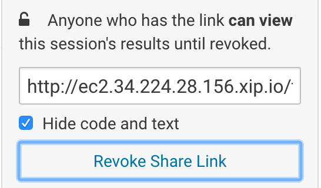{width="3.4166666666666665in"
height="1.4375in"}

Note that this workbench is independent of any other project's
workbench. You want to try out different and conflicting libraries? Have
at it! Just start another project, open the workbench, pick the
libraries you want, install them and off you go. Just like on your
laptop, but this is managed, secure, stable, won't get stolen from a
taxi, is always available and easily shared!

All of this isolation is achieved by mounting filesystems (one or more
per project) into docker containers (one per engine). The details don't
matter, except to note that now you can really go mad and try out lots
of different and conflicting permutations without having to go down the
complex path of virtual environments etc. It's all been done for you!

**Question**: How many beers will the IT guys buy you when they realize
that you now have a secure, auditable and managed system where they
don't have to pick and choose the libraries that you install?

 
-

Lab 4 - Visualization and Sharing
=================================

Check that you have NO sessions running - if any sessions are running
then stop them now. You've setup your environment and those sessions can
be safely disposed of.

Data Science is often about visualizing ideas, and then sharing them to
persuade others to take action. CDSW lets you use the visualization
tools you'd use naturally, and adds a neat twist to the whole idea of
sharing. Let's get started:

1.  Start up a new **Python 3** session (2vCPU, 4GiB) in the same manner
    > you did before.

2.  Select **1\_python.py** in the file browser

3.  Run the entire file (multiple ways of doing that - try to figure out
    > more than one way. It should be pretty obvious!). You should end
    > up with some nice graphs in the output window:

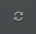{width="6.5in"
height="4.527777777777778in"}

4.  In the top right of that graphic is a little 3 bar icon - click on
    > it and you get these handy options:

{width="2.4270833333333335in"
height="2.0416666666666665in"}

5.  You can see that CDSW is very similar to a notebook, supporting the
    > same visualization tools. However, unlike a notebook, it doesn't
    > use cells: instead it uses markup in the source file, and an
    > output window. Furthermore, that window has some interesting
    > properties ...

6.  Scroll up to find this diagram:

{width="6.276042213473316in"
height="5.340670384951881in"}

7.  On the left is a little chain link button:
    > 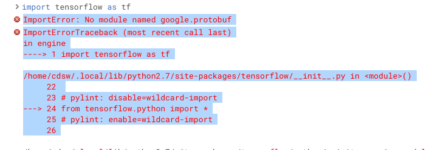{width="0.3940004374453193in"
    > height="0.4947922134733158in"}

8.  Click on it and you'll see beneath the chart some html that can be
    > used to embed that chart into a website:

{width="6.816174540682415in"
height="7.630208880139983in"}

9.  Scroll to the top of the window and you'll see this on the far
    > right:

{width="1.328125546806649in"
height="1.033976377952756in"}

10. Hit the 'collapse' link and see the difference in the output window.

11. Question: What difference did you see? How might this be used? Is it
    > useful?

12. Notebooks have great output, but how do you share what they show
    > you? CDSW solves this by simply providing a link to the output
    > that you can send to anyone and they can see the output. Try it:

13. Select the 'Share' link from either a Public or Private project:

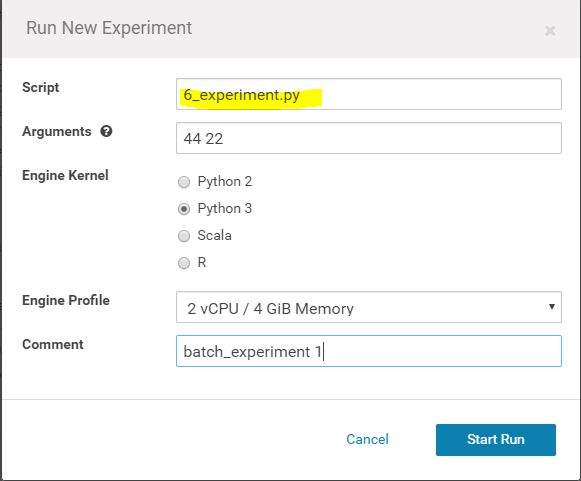{width="3.151042213473316in"
height="1.3670669291338582in"}

14. And then 'Generate Share Link' (your URL will be similar, but
    > different from this one):

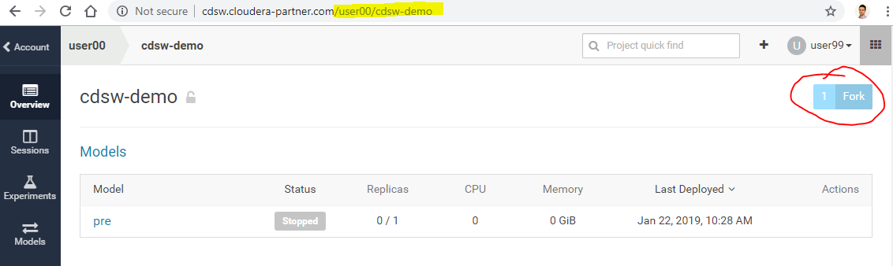{width="3.3281255468066493in"
height="1.9362018810148731in"}

15. Cut and paste that link and put it into some other browser (best to
    > be a completely different browser, or on a incognito window, than
    > the one you're logged in with, but not that important)

16. You should see that you have access to almost the same output window
    > (this new one doesn't have this share link!)

**Question**: How would you use this sharing capability to keep your
co-workers informed about what you're doing?

**Question**: How would you change your presentation to take advantage
of the collapse/expand capabilities of this sharing system?

So we've demonstrated how CDSW is like a notebook, but is perhaps more
powerful, and has great sharing capability. Let's go on to see about
integration with Hadoop!

 
-

Lab 5 - Hadoop Integration - Run a PySpark job
==============================================

In this lesson we'll see two mechanisms for integrating with Hadoop:

1.  Filesystem - storing data in Hadoop itself using HDFS

2.  Computation - executing code on the Hadoop cluster via Spark

Stop all sessions you have currently running. Start a new **Python2**
session.

1.  Select the **2\_pyspark.py** file.

2.  Look at line 34:

3.  !hdfs dfs -put -f \$HOME/data/kmeans\_data.txt
    > /user/\$HADOOP\_USER\_NAME

4.  **Question**: What is this line doing? Where is the data coming
    > from? Where is it going to?

5.  You can see that the original data (stored under the data directory
    > of our project) is copied into HDFS. The data is tiny (go look at
    > it with the file browser!), but the principle is what applies -
    > simple integration with HDFS.

6.  Execute the 2\_pyspark.py file in your already running Python
    > session

7.  **Question**: What did it do?

8.  **Question**: What kind of thing is the variable 'data'? (try typing
    > 'data' into the console and seeing what gets printed out.

9.  Open a terminal using the 'terminal' icon in the top right:
    > {width="5.677083333333333in"
    > height="0.5520833333333334in"}

10. Execute 'hdfs dfs -ls' to see the data file in the hadoop file
    > system (or, to show off, execute '! hdfs dfs -ls' in the python
    > console to do the same thing!)

If everything went correctly you'll see that we demonstrate:

-   Natural integration with HDFS - it's just a path to a file!

-   Natural parallel computation across the cluster using Spark

**Question**: If you had 20TB and 50 nodes with 32 processors per node
how much faster do you think a KMeans algorithm would take compared to
running it on your laptop? 10X? 100X?

**Question:** What shell is running in that terminal? What else can you
do in the terminal? Does it remind you of a terminal access to your
Linux laptop?

 
-

Lab 6 - Pushing the Boundaries with TensorFlow
==============================================

So you've just heard that the latest thing from Google is
[[Tensorflow]{.underline}](https://www.tensorflow.org/) and you're keen
to get started. You're going to need to install some custom packages
and, more importantly, connect a program providing a web interface so
that you can view the results. Your IT department isn't going to help
you - you're going to want to do this experiment on your own.

Fortunately CDSW enables you to install custom libraries. This cluster
might be managed by IT but you can still get your libraries in there to
do the work you need ...

We've done the hard work for you - take a look:

1.  Stop all sessions. Start a new **Python 3** session.

2.  Select **3\_tensorflow.py**

3.  Lines 2 through 10 show the imports of the various libraries (we
    > installed them in Lab 3)

4.  Run 3\_tensorflow.py in your current Python session - the input
    > handwritten number images are shown, along with some images of
    > feature maps for particular numbers

5.  In the output on the right hand side, at the bottom, is a blue link
    > 'Open Tensorboard'. Selecting that link opens an application,
    > running within your CDSW engine, to examine the Tensorboard
    > system. Note that because we are using a dynamic DNS service for
    > these labs it might take as long as a minute before that URL is
    > useful - what's happening is that the DNS records are being
    > updated in real time to point that URL to the right place, so you
    > might have to wait until those records are updated.

Note - if everyone is using a different ID you shouldn't see any errors.
If attendees are using the same ID you're likely to see some output with
errors like this:

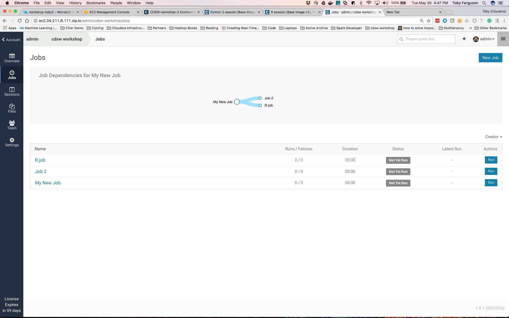{width="4.807292213473316in"
height="2.749659886264217in"}

We're not certain, but we believe that this is because the TensorBoard
application is being run multiple times by the same service user on the
CDSW Gateway node and is an issue in the TensorBoard code.

Key takeaways: You were able to install and use custom third party
libraries, as well as run an application that you can connect to from an
external application

Lab 7 - R
=========

SparklyR
--------

We've focused on python integration, but just to show we can do similar
things with R, let's take a look at the R programs and execute them.
Let's start with connecting to and running Spark from an R session.

Start up an R session (2vCPU, 4GiB engine).

1.  Switch to the **R Session**.

2.  Select (and run) **4\_sparklyr.R**

3.  Can you figure out some of the things it's doing? If you know R, and
    > if you know sparklyr, then you can get detailed; if you don't know
    > R then simply 'collapse' the output and see if you can make sense
    > of the analysis without looking at any code ... hopefully you can!

Shiny
-----

R has a great interactive experience using the shiny package. In this
lab we'll create an interactive histogram and you can work with it to
find out the frequency distribution of the period between Yellowstone
Geyser eruptions!

Run the **5\_shiny.R** application

This will start up a shiny server in the local context (line 16), and
connect it to the server/ui code (in server.R and ui.R, respectively).

Your users are then presented with a nice little application where they
can experiment with changing some of the parameters and graphing
features of R's base graphics histogram plot!

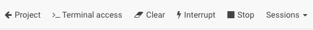{width="6.5in"
height="4.611111111111111in"}

Try generating a share link and opening up the share in another browser
window - amazingly enough each browser share is independent, allowing
your users to share the same underlying experience, but with their
individual data inputs!

**STOP all your R Sessions now - this will help free up resources for
everyone**

**Question**: Is this kind of interactivity with data likely to change
the way your business users understand and appreciate the work of the
Data Scientists?

Lab 8 - Scala
=============

In this lab we show how you can use the 'Template' mechanism to get
started with a simple Scala example:

1.  Navigate to the project space by selecting "project":

{width="1.2552088801399826in"
height="0.5639337270341207in"}

2.  Create a new project by hitting the '+' button on the top right and
    > selecting 'create project':

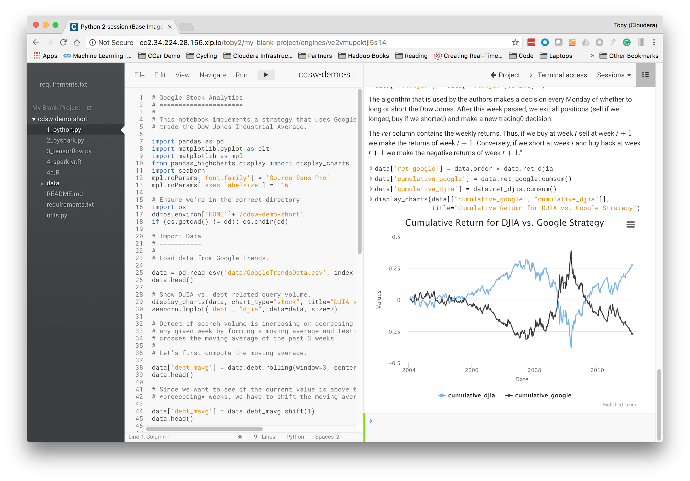{width="2.526042213473316in"
height="1.571075021872266in"}

3.  In the Create new Project window that comes up provide a name for
    > your new project ('Scala', for example), and then choose the Scala
    > template:\
    > 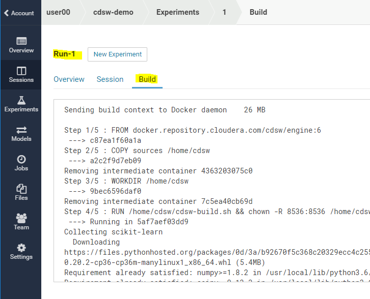{width="4.682292213473316in"
    > height="4.262436570428696in"}

4.  Create the project. You'll see the File Browser view onto the
    > project.

5.  Hit '**Open Workbench**' in the top right and let's go run some
    > Scala code:

6.  Start a **Scala** session

7.  The Scala example project includes its own data set that needs to be
    > moved into HDFS, since that is where the scala code expects to
    > find it. Open a Terminal by clicking on the **\>\_Terminal
    > access** button and execute the following shell commands to do
    > this. Note how you have ready access to your own project's data
    > (purely local to you) and the secure (and massive) HDFS cluster:

8.  \$ hdfs dfs -put data /tmp/datauserXX (replace XX with your user
    > number)

{width="7.5in"
height="4.083333333333333in"}

9.  Execute one or more of the various scala files in the Workbench

**Question:** How will you use templates when demonstrating CDSW to your
friends and colleagues?

STOP your Scala session now

 
-

Lab 9 - Experiments
===================

It's often the case that data scientists need the ability to iterate and
repeat similar experiments in parallel and on demand, as they rely on
differences in output and scores to tune parameters until they obtain
the best fit for the problem at hand. Such a training workflow requires
versioning of the file system, input parameters, and output of each
training run.

This lab will give you practice running non interactive batch execution
scripts called Experiments that are versioned across input parameters,
project files, and output associated with a specific versioning of the
project files retaining run-level artifacts and metadata.

1.  Open up your cdsw-demo project and open the workbench.

2.  Select file 6\_experiment.py and inspect the code. What do you think
    > it does?

3.  From the Workbench launch a 2 vCPU/4 GiB memory Python3 session and
    > enter the in the command prompt to run the file and verify it is
    > working:

!python 6\_experiment.py 11 1

{width="7.5in"
height="4.097222222222222in"}

You now have a working python file which takes parameters that we can
use to run some Experiments.

4.  Stop your python session. (Sessions-\>Stop)

5.  There are multiple ways in CDSW to run your Experiments:

    a.  Go back to the main window for your project to run an
        > Experiment.

    b.  From the Workbench you can also select **Run-\>Run Experiment**.

6.  Fill out the screen with your add.py file and sample numbers for the
    > Arguments to sum. Use the 2vCPU/4GiB RAM Python3 engine available
    > for this example.\
    > Hit the **Start Run** button to start the Experiment:

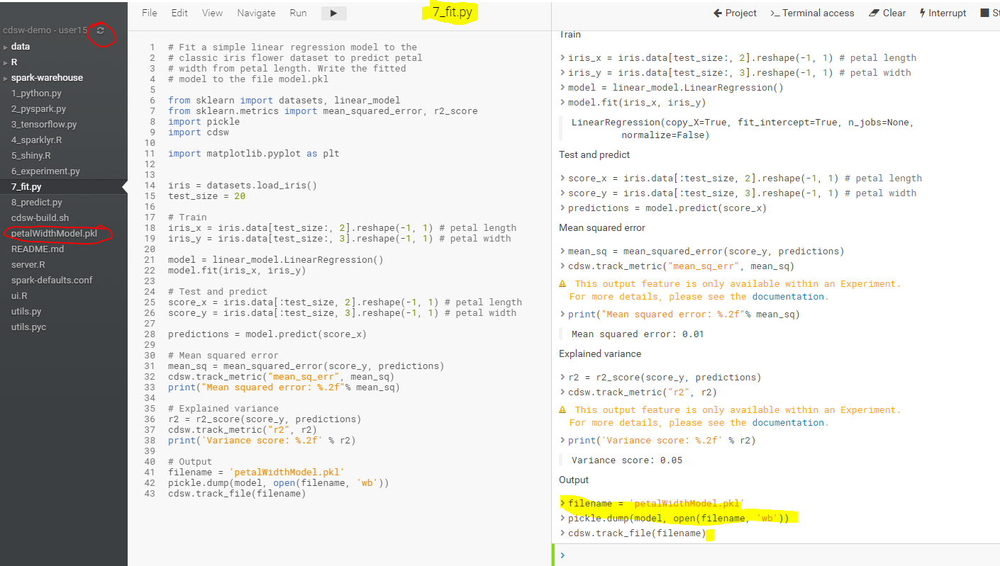{width="6.052083333333333in"
height="5.010416666666667in"}

7.  You will see the Experiment status in the main **Experiments**
    > screen show various lifecycle status; Queued, Building,
    > Scheduling, Running and then Success. The output will be added as
    > a column called "Sum" from your Experiment code shown below. You
    > could also save the output into a file as well or instead.

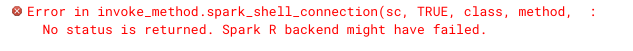{width="7.5in"
height="1.7083333333333333in"}

8.  While it's going through the various status, go ahead and select the
    > Run job (job 1 in above screen shot). If you can, look at the
    > build status before the job completes to see the build process or
    > run another job if you would like to see the build status in
    > process.

{width="7.5in"
height="6.069444444444445in"}

Can you think of examples of batch experiments with different input
parameters and project files that would be be good to have multiple
parallel runs and corresponding output to compare.

Lab 10 - Models
===============

Data scientists often develop models using a variety of Python/R open
source packages. The challenge lies in actually exposing those models to
stakeholders who can test the model. The data science team also needs a
reliable way to retain history of the models they build and ensure that
they can rebuild a specific version if needed

This lab will give you practice packaging a trained model into an
immutable artifact and deploying models as REST APIs.

1.  Open Workbench and start a **Python 3** session using the 2 vCPU/ 4
    > GiB RAM engine.

2.  Open the file **7\_fit.py** and run it. You will see the code
    > created a model called "petalWidthModel.pkl":

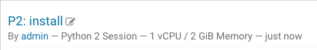{width="7.5in" height="4.25in"}

3.  Before we deploy this model, let's test it in the workbench. Open
    > file **8\_predict.py** and run it. Then, to confirm that the
    > predict() function works as expected, run this line of code by
    > copying and pasting into the workbench prompt, see below
    > screenshot:\
    > \
    > predict({\"petal\_length\": 19})\
    > \
    > You should see the output like this:\
    > \
    > {width="7.5in"
    > height="2.5694444444444446in"}

Now let's deploy the add function to a REST endpoint.

4.  Stop your Python 3 Session used in step 3 above.

5.  Go to the project overview page and select **Models-\>New Model**
    > from the left hand bar.

6.  Enter a name, description, select the python file **8\_predict.py**,
    > the **predict** function, and Example Input as per below
    > screenshot:

> {width="3.71875in" height="9.46875in"}

7.  Click on the model you just added and go to its **Build and
    > Monitoring** pages to watch the build process until it completes.

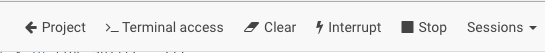{width="7.5in"
height="1.5833333333333333in"}

8.  Once the model has been built and **deployed**, go back to the model
    > **Overview** page and use the **Test Model** widget to make sure
    > the model works as expected.

You can test using Shell, Python, and R to see the various ways the
model can be accessed using a rest a REST interface:

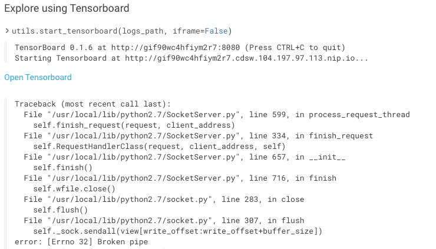{width="7.5in"
height="6.861111111111111in"}

Each model in Cloudera Data Science Workbench has a unique access key
associated with it. This access key serves two purposes: 1) it is a
unique identifier for the model, and 2) it serves as an authentication
token that allows you to make calls to the model.

9.  Note the access key used in the test examples. You would need this
    > access key to use the Model from a REST API. Click on the Setting
    > tab in your Model to see your key and the option for Regenerating
    > a new Model Access Key.

10. Now try on your own to see if you can figure out how to use the
    > model from your environment.

11. Stop your Model deployment when finished with this lab.

Lab 11 - Scheduling Jobs
========================

It's often the case that you need to execute tasks on a periodic basis,
and to execute one or more tasks once some other task has succeeded.
Obviously there are sophisticated workflow engines many customers are
already using. For simple workflows CDSW has a handy jobs system built
in. Jobs can also be exposed for for use from other scheduling systems.

This lab goes through the mechanics of creating a simple multi-step job
process.

1.  Open up your '**cdsw demo**' project to get to this screen:

2.  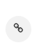{width="6.5in"
    > height="4.069444444444445in"}

3.  Select the 'new job' link in the middle of the page, and you'll get
    > to the following screen (there are other ways of getting to this
    > next screen - its an exercise for the student to figure out what
    > they might be):

4.  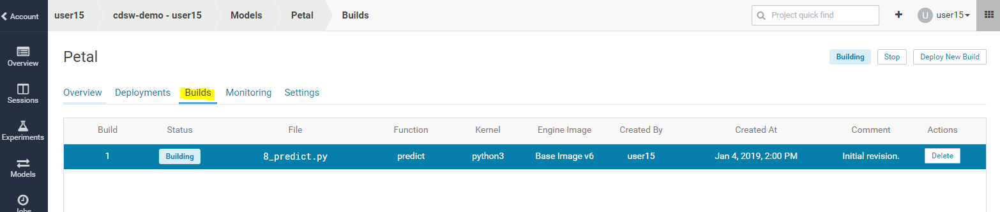{width="6.5in"
    > height="4.069444444444445in"}

5.  Create a job that will be triggered manually and will execute the
    > 1\_python.py. Here are the parameters to do that:

6.  

  Name            My New Job
  --------------- --------------
  Script          1\_python.py
  Engine Kernel   Python 3

7.  8.  Leave everything else as default. Scroll down and hit 'Create
    > Job'. You should get to this screen:

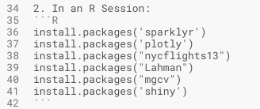{width="6.5in"
height="4.069444444444445in"}

9.  Here you can see that you have a job ('My New Job'). It's never been
    > run, and it has no dependencies.

10. Let's make other jobs depend on this one: Click the '+ Add Job
    > Dependency' grayed out button and add a new job that has a
    > dependency on 'My New Job'. The parameters are:

11. 

  Name            Job 2
  --------------- ---------------
  Script          2\_pyspark.py
  Engine Kernel   Python 2

12. Scroll down and 'Create Job'. You'll now see a page like this:

{width="6.5in"
height="4.069444444444445in"}

13. So here we can see that 'Job 2' depends upon 'My New Job' (although
    > you can run each manually, if you so choose).

14. Lets add another job that will run in parallel with Job2:

15. Click 'New Job' in the top right corner and create another job that
    > depends upon 'My New Job'. The parameters you'll need are:

16. 

  Name            R Job
  --------------- ------------------------
  Script          4\_sparklyr.R
  Engine Kernel   R
  Schedule        Dependent / My New Job

17. Create the job and you'll see this:

{width="6.5in"
height="4.069444444444445in"}

18. Lets run it all - hit the 'Run' button next to 'My New Job' (bottom
    > of the list of jobs). You should see the job get scheduled, run,
    > complete, and then the next two jobs should likewise get
    > scheduled, run and complete:

{width="6.5in"
height="4.069444444444445in"}

**Question**: How will a job scheduler reduce the effort required for
you to build simple pipelines?

**Question**: What other facilities surrounding a job did we not
explain? What do you think those other parameters might do?

**That's It Folks**

Thanks for working your way through the labs and we hope you learned how
CDSW might make your Data Science journey easier. Please fill out the
survey form!

Appendix
========

Using your own CDSW cluster
---------------------------

If you're using these instructions as part of a Self Service training
then you'll have constructed your own CDSW cluster and the fully
qualified domain name (FQDN) of your CDSW instance is what you
configured in the [[Set Up a Wildcard DNS
Subdomain]{.underline}](https://www.cloudera.com/documentation/data-science-workbench/latest/topics/cdsw_install.html#set_up_wildcard_dns)
section of the installation instructions. If you have root access to the
CDSW instance you can execute the following, and the FQDN is the value
of the 'DOMAIN' key/value pair[^1]:

grep \'\^DOMAIN=.\*\' /etc/cdsw/config/cdsw.conf

To install a demo CDSW cluster in MS Azure, you can follow the example
how to guide
[[https://github.com/fabiog1901/cdsw-install]{.underline}](https://github.com/fabiog1901/cdsw-install)

The original project was taken from
[[https://github.com/fabiog1901/cdsw-demo]{.underline}](https://github.com/fabiog1901/cdsw-demo)

 
=

Troubleshooting
===============

DNS Issue
---------

If you see something like this:

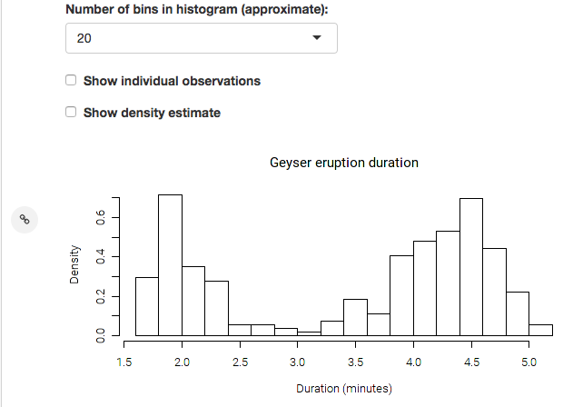{width="6.5in"
height="3.4027777777777777in"}

Or (when you open a terminal), like this:

Then just refresh your browser.

On Windows you might have to flush your dns cache. To do that open up a
command prompt and then execute

ipconfig /flushdns

The root cause of this is that the DNS database on our DNS provider
(xip.io) are being actively updated but that takes time (a few seconds)
and you're requesting a DNS record that hasn't yet been added. So
requesting again after a little while is a sensible thing to do ... and
might need to be repeated, depending on how quickly the records are
updated.

Spark R backend might have failed
---------------------------------

{width="6.5in"
height="0.5277777777777778in"}

Or:

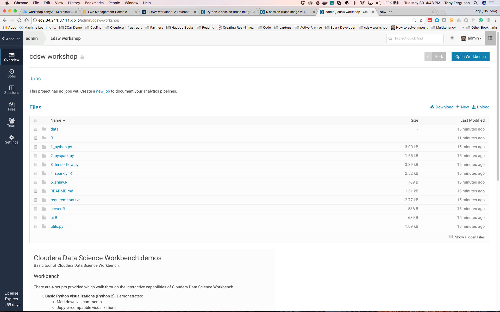{width="6.458333333333333in"
height="0.8125in"}

Or

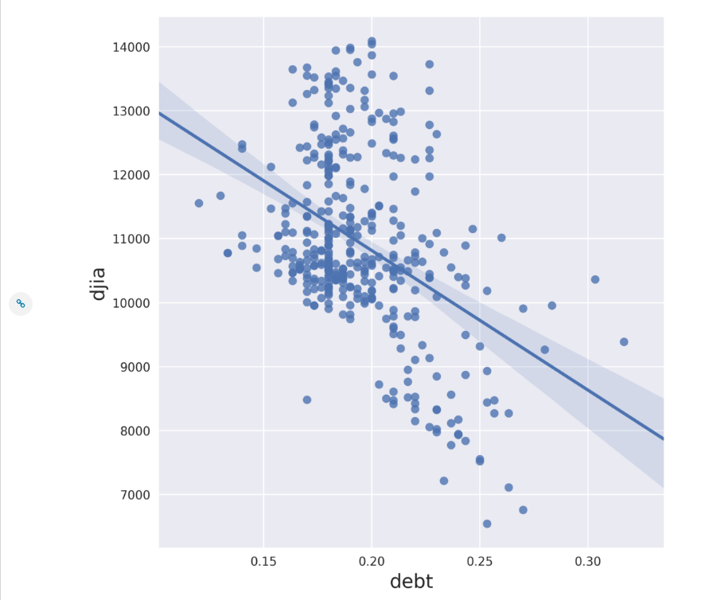{width="6.5in"
height="1.8888888888888888in"}

Then you likely chose a 2G engine - stop that session and start another
one, this time with a 4G session

At times we are seeing connections problems with the dynamic DNS
configuration we are using specifically for this lab setup. If you
experience ongoing connection problems, try stopping your sessions and
restarting. That appears to re-establish connections through the dynamic
DNS.

ImportError: No module named google.protobuf
--------------------------------------------

If you see an error like this:

{width="6.5in" height="2.25in"}

And you're running Lab 6, then you've probably forgotten to stop your
current python session and start a new one. There's a bug in the
Tensorflow libraries in the way that the installed packages get
resolved. The simplest workaround is to start a new session!

[^1]: Only true for CDSW versions installed via packages and not using
    Cloudera Manager and parcels.
